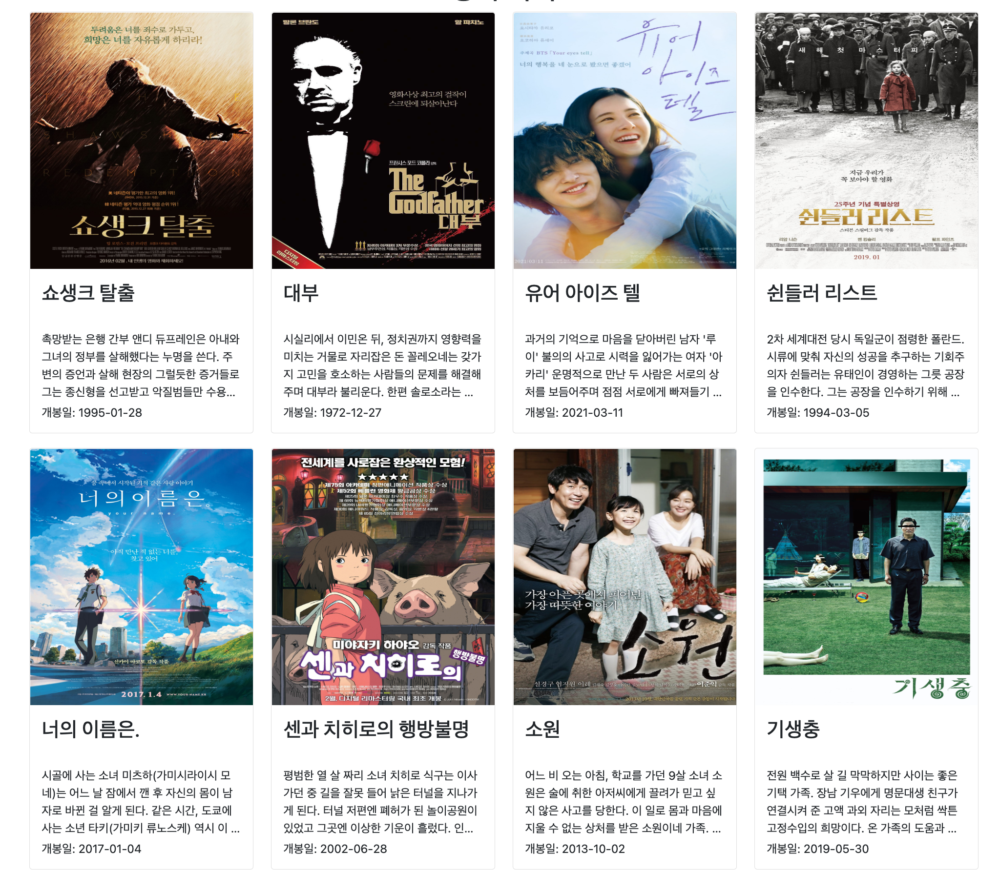

# README.md

# 프레임워크를 활용한 웹 페이지 구현

---

> **프로젝트 주제: Django와 Bootstrap을 활용한 웹 페이지 구현"

⏰ **시행 날짜:** 2022.03.04 금

🍀 **개발환경:** Visual Studio Code

👄 **개발언어:** html, css, python

📚 **라이브러리:** **부트스트랩 v5, Django 3.2, requests**

**⚒ 개발 도구** 

- Visual Studio Code
- Google Chrome Browser
- Bootstrap v5.0

🎯 **목표**

-  HTML&CSS를 통한 웹 페이지 마크업 및 스타일링
- Bootstrap 컴포넌트 및 그리드 시스템을 활용한 반응형 레이아웃 구성 
- Django web framework를 활용한 웹 서버 구성
- Django Template System을 활용한 웹 페이지 마크업

---

## 📂 폴더구성

`특정 depth 까지만 출력: tree -L 1`

- pjt04: django 프로젝트 이름
- movies: 앱
- templates: base.html 디렉토리

```
pjt04
.
├── db.sqlite3
├── manage.py
├── movies
│   ├── __init__.py
│   ├── __pycache__
│   ├── admin.py
│   ├── apps.py
│   ├── migrations
│   ├── models.py
│   ├── static
│   ├── templates
│   │   ├── index.html
│   │   └── recommendations.html
│   ├── tests.py
│   ├── urls.py
│   └── views.py
├── pjt04
│   ├── __init__.py
│   ├── __pycache__
│   ├── asgi.py
│   ├── settings.py
│   ├── urls.py
│   └── wsgi.py
├── requirements.txt
├── static
├── templates
└── venv
```

---

## 🏁 URL

| URL 패턴                 | 역할                             |
| ------------------------ | -------------------------------- |
| /movies/                 | 메인 페이지 조회<br /            |
| /movies/recommendations/ | API를 사용한 특정 추천 영화 조회 |

---

## 🏋🏻‍♂️ Django & Bootstrap

### 1. settings

- pjt04 프로젝트에서 movies 디렉토리의 urls.py로 url 전달

  ```python
  from django.contrib import admin
  from django.urls import path, include
  
  urlpatterns = [
      path('admin/', admin.site.urls),
      path('movies/', include("movies.urls"))
  ]
  ```

- 공유 템플릿 생성 및 사용을 위한 pjt04/settings.py

  ```python
  
  TEMPLATES = [
      {
          'BACKEND': 'django.template.backends.django.DjangoTemplates',
          'DIRS': [BASE_DIR / "templates"],
          'APP_DIRS': True,
          'OPTIONS': {
              'context_processors': [
                  'django.template.context_processors.debug',
                  'django.template.context_processors.request',
                  'django.contrib.auth.context_processors.auth',
                  'django.contrib.messages.context_processors.messages',
              ],
          },
      },
  ]
  
  STATIC_URL = '/static/'
  
  STATICFILES_DIRS = [
      BASE_DIR / 'static',
  ]
  ```

2. ### **메인 페이지(index.html)**

   - TMDB로 부터 영화 데이터 요청

     - 렌더링에 필요한 데이터만 추출하여 클라이언트로 전달

     ```python
     def index(request):
         BASE_URL = 'https://api.themoviedb.org/3/movie/top_rated'
         movie_list =[]
         params = {
             'api_key': '',
             'region': 'KR',
             'language': "ko",
             "page": 1,
         }
         response  = requests.get(BASE_URL, params=params )
         data = response.json()
         if data.get("results"):
             movie_data = data.get("results")[:8]
             
             for i in movie_data:
                 tmp ={
                     "id": f'movie{i.get("id")}',
                     "title": i.get("title"),
                     "overview": i.get("overview"),
                     "release_date": i.get("release_date"),
                     "poster": f'https://image.tmdb.org/t/p/original{i.get("poster_path")}',
                 }
                 movie_list.append(tmp)
         context = {
             "movie_list": movie_list
         }
         return render(request, 'index.html', context)
     ```

   - BootStrap을 활용한 Grid 및 반응형 구현

     ```html
         <article class="col-12 col-sm-6 col-md-4 col-lg-3">
             <div class="card">
               
               <div class="card-body">
                 <h3 style="height: 60px">{{ data.title }}</h3>
                 <p class="card-text overview">{{ data.overview }}</p>
                 <p>개봉일: {{ data.release_date }}</p>
               </div>
             </div>
           </article>
     ```

   - footer 내 상단 이동 버튼 

     ```html
         <footer class="footer">
           <p>SSAFY</p>
           <div class="top">
             <a href="#top"> <p>^</p> </a>
           </div>
         </footer>
     ```

   - 줄거리 길이를 통일 시키기 위해 일부만 보이도록 수정

     ```css
     .overview {
       white-space: normal;
       display: -webkit-box;
       -webkit-line-clamp: 4;
       -webkit-box-orient: vertical;
       overflow: hidden;
       height: 100px;
     }
     ```

     

   **🌏 브라우져 결과 화면**

   <div align="center">
     
   </div>

### 3. 추천 영화 페이지 (recommendations.html)

- '쇼생크 탈출'과 비슷한 영화 추천 API 요청

  ```python
  
  def recommendations(request):
      recommendation_movie_list = []
      BASE_URL = 'https://api.themoviedb.org/3'
      path = '/search/movie'
      params1 = {
          'api_key': '',
          'region': 'KR',
          'language': "ko",
          'query': "쇼생크 탈출"
      }
      params2 = {
          'api_key': '',
          'region': 'KR',
          'language': "ko"
      }
      response = requests.get(BASE_URL+path, params=params1)
      data = response.json()
      results = data.get('results')
      
      if results:
          movie_id = results[0].get('id')
          if movie_id:
              recommendation_path = f'/movie/{movie_id}/recommendations'
              recommendation_response = requests.get(
                  BASE_URL+recommendation_path, params=params2).json()
              recommendation_results = recommendation_response.get('results')
              if recommendation_results:
                  for i in recommendation_results:
                      tmp = {
                          "title": i.get("title"),
                          "poster": f'https://image.tmdb.org/t/p/original{i.get("poster_path")}',
                          "site": f'https://www.themoviedb.org/movie/{i.get("id")}',
                          "release_date": i.get("release_date"),
                          "overview": i.get("overview"),
                          "vote": round(i.get("vote_average"), 1)
                      }
                      recommendation_movie_list.append(tmp)
  
      reccomended_movie = random.choice(recommendation_movie_list)
      context = {
          "movie": reccomended_movie
      }
      return render(request, 'recommendations.html', context)
  ```

  	- 랜덤 모듈을 통해 매번 다른 영화를 하나씩 추천

- 상세정보를 클릭 할 경우 해당 페이지로 이동

  ```python
  "site": f'https://www.themoviedb.org/movie/{i.get("id")}',
  ```

- 미디어 쿼리를 통한 반응형 웹 구현

  ```css
  @media screen and (min-width: 576px) {
    .card-box {
      flex-direction: row;
      width: 500px;
    }
    .fig-sentence {
      font-size: 50px;
    }
  }
  
  @media screen and (min-width: 992px) {
    .card-box {
      flex-direction: row;
      width: 800px;
    }
  }
  
  @media screen and (min-width: 1452px) {
    .image-container {
      width: 1400px;
    }
  }
  
  ```

  

**🌏 브라우져 결과 화면**

- <div align="center">
    
  </div>

  

---

## ⭐️ 기능

- 메인 페이지에서 보이는 내용과 카드 크기를 통일 시킴으로써 유저에게 보이는 시각적인 불편함을 줄임

<div align="center">
  
</div>


- 부트스트랩을 쓰면 원하는 CSS가 구현이 되지 않음
  - 부트스트랩 사용 미흡으로 생각함
  - CSS를 통해 구현하고자 하는 것들을 구현
    - ex) 영화 추천 페이지 반응형 카드